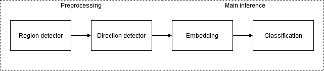
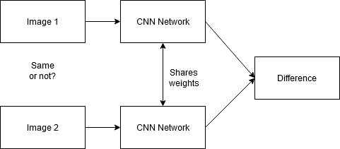
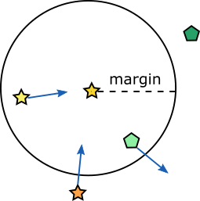
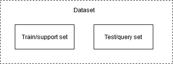

# Documentation

This is a high level documentation of the system.

## Pipeline

The purpose of the system is to be able to identify which specific individual a fish is,
or classify it as a new observation if it hasn't been seen before.
For this the following pipeline has been designed.

The purpose of the first two networks are to generate the required input for the later stage.
The region detector crops the interesting part out of an image and the direction detector detects the direction the fish is facing.
The direction of the fish is used such that the system thinks a left-facing fish is different from
a right-facing fish. This is because the fish may have a different pattern on the other side.

The embedding network is the main part of the system and has the job to learn good embeddings from the images.
This part can be seen as a transformation from a very high dimensional space to a lower.
The embeddings can then be cheaply and effectively classified by the classification algorithm.

## Networks

This section contains a brief description of all the networks in the pipeline.

### Region detector

The region detector takes as input an image and a darknet format label file.
This format is a text file that contains (class) (x) (y) (width) (height)
where the values are relative to the size of the image.
A tool like [LabelImg](https://github.com/tzutalin/labelImg) can be used to annotate the images with the required format.
The purpose of the region detector is to crop out part of an image, like the body or head region of a fish.

### Direction detector

The purpose of the direction detector is to detect whether a fish is facing to the right or left.
It trains on a set of images and a metafile that has the mapping between images and direction.
This metafile can be created using the direction_labeler.py tool.

### Embedding network

The embedding network is the most important part of the network and high performance on this model is essential. 
The network tries to learn a good mapping between images and a 128-dimensional descriptor.
It tries to keep embeddings of the same individuals close together while different separated.
This can be achieved with various models and loss functions that will be explained in the few-shot learning section below.

### Classification part

Given a good embedding network, the classification is quite simple.
As the same individuals are mapped close together, a nearest neighbor search can be used for the classification.

## Few-shot learning

Few-shot learning is a machine learning techniques in which you have few training examples per class.
One such technique is to transform the data into embeddings that clusters points
from the same class together and then perform classification on these.

A siamese network [[2]][2] is a common technique for this.
The siamese network is a network which takes two inputs through the same network with the same shared weights and gets an embedding for both.
With these embeddings it tries to predict whether they are of the same class or not.
A major advantage here is that it does not need to know which class an input belongs to nor how many classes there are.

Contrastive loss [[3]][3] is a loss function that is often used together with siamese networks.
It tries to cluster embeddings of the same class together while pushing different classes outside a specified margin.
So if the inputs are the same class it tries to push them together, and the opposite if they are not.

Another loss is the triplet loss [[4]][4], which has three inputs (anchor, positive and negative).
It compares the anchor input to the positive (same class) and the negative input (different class).
Both losses have the same objective, to cluster same classes together.
But triplet loss adjust both the positive and negative class at the same time.

The problem with triplet loss is that there will be very many negative inputs that are very easy and will give zero loss.
This is because given an anchor and a positive input, there is a very high chance that the negative input selected will be outside of the margin of the anchor.
Therefore online hard negative mining [[4]][4][[5]][5] can be used to only train on samples that have hard negatives.
This also have the benefit that you don't need to have three identical models loaded in memory, because this step is done after the embeddings are calculated.

## Self-supervised learning

Self-supervised learning is a learning strategy where labels are generated automatically by the system [[6]][6].
One problem with such systems is that they often require heavy modifications [[7]][7]
SimCLR [[8]][8] is however a method which can be easily implemented into existing frameworks and pipelines.
It is based on the siamese network, but it takes unlabeled images as input.
The system then takes a copy of each image and sends each pair of into a random augmentation process.
It then passes the two images through the siamese network and applies a loss the authors refer to as Normalized Temperature-scaled Cross Entropy (NT-Xent).
This loss is based on Noise Contrastive Estimation (NCE) which tries to approximate non-parametric softmax.
It is non-parametric in that sense that each image instance is treated as a separate class and the approximation comes from the batch size instead of using all available instances.
A disadvantage with this method is that it works best with a large batch size such that it gets a large collection of negative pairs, but a memory bank structure can be used to alleviate this [[9]][9].
An advantage with this is that it is a one-shot algorithm, but you have to either make sure no two images of the same individual is in the same batch or consider it noise, because it will handle them as a negative pair.

## Performance metric

Classification accuracy is possibly the most important performance metric to look at in the end,
but it is not a good metric for comparing models and seeing how it improves.
This is because if the model is very close to predicting the correct value, it will still give no score.
Therefore mean average precision at 5 (mAP@5) is used to assess the model [[1]][1].

The metric takes the mean of the average precision at 5 of all the samples.
The average precision at 5 is the reciprocal value of the position (1-indexed)
of the first occurrence of the correct class or 0 otherwise.
Given the prediction [B, A, C, C, A] and the correct class is A, the average precision at 5 will be 1/2.

## Dataset partitioning

The embedding network and the classifier has a kind of contrasting need when it comes to the dataset partitioning.
The embedding network needs there to be many same pairs to train on, while the classifier needs a good mix of already observed individuals and new observations.
This can become slightly problematic when each class only has two images because when you shuffle and split the data randomly between a train and test set,
the embedding network will end up with not as many same pairs as it would get by splitting based on class.
However if the dataset is split based on the class, the classifier will not have any earlier observed individuals.
This is just an observation that was made, but the most practical way to partition the dataset that was found is as follows.

The dataset is randomly split into a test and train set.
The embedding network trains on the training set and evaluates the performance on the test set.
The classifier assigns the training set as support set and evaluates the performance on the query set.
The query set can also be further partitioned into a test and validation set if the new observation threshold is searched for.

[1]: https://www.kaggle.com/c/humpback-whale-identification/overview/evaluation
[2]: https://papers.nips.cc/paper/769-signature-verification-using-a-siamese-time-delay-neural-network.pdf
[3]: http://yann.lecun.com/exdb/publis/pdf/chopra-05.pdf
[4]: https://arxiv.org/pdf/1503.03832.pdf
[5]: https://omoindrot.github.io/triplet-loss
[6]: https://arxiv.org/pdf/1902.06162.pdf
[7]: https://ai.googleblog.com/2020/04/advancing-self-supervised-and-semi.html
[8]: https://arxiv.org/pdf/2002.05709.pdf
[9]: https://arxiv.org/pdf/1805.01978.pdf